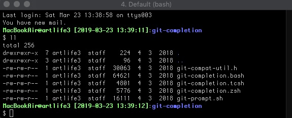
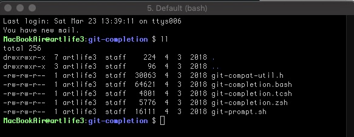
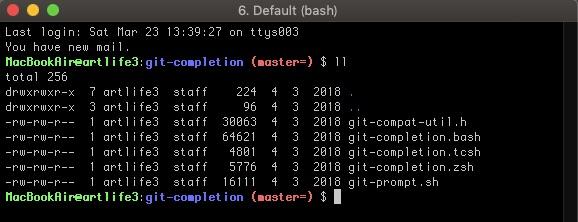
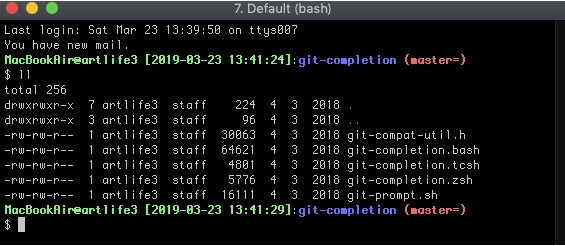
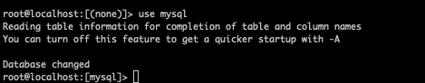

# linux-configuration

## 環境設定について

### 設定ファイルのPATH

* CentOS
  * `/etc/environment`
* MacOS
  * `/etc/profile`

### 設定内容

```
ENV_MODE="localhost"
#ENV_MODE="production"
#ENV_MODE="staging"
#ENV_MODE="development"
#ENV_MODE="trial"

# Change the color for each environment.
ENV_COLOR="$'32m'" # Localhost
#ENV_COLOR="31m" # Production
#ENV_COLOR="$'33m'" # Staging
#ENV_COLOR="$'34m'" # Development
#ENV_COLOR="$'35m'" # Trial
```


## About `.bash_profile`

### PS1設定Example

#### Datetime added
```
export PS1='\[\033[1;$ENV_COLOR\]\h@\u [\D{%Y-%m-%d %T}]\[\033[00m\]:\[\033[1;34m\]\W \[\033[00m\]\n\$ '
```


#### Standard
```
export PS1='\[\033[1;$ENV_COLOR\]\h@\u\[\033[00m\]:\[\033[1;34m\]\W \[\033[00m\]\$ '
```


#### With Git
```
export PS1='\[\033[1;$ENV_COLOR\]\h@\u\[\033[00m\]:\[\033[1;34m\]\W\[\033[1;31m\]$(__git_ps1)\[\033[00m\] \$ '
```


#### Datetime added with Git
```
export PS1='\[\033[1;$ENV_COLOR\]\h@\u [\D{%Y-%m-%d %T}]\[\033[00m\]:\[\033[1;34m\]\W\[\033[1;31m\]$(__git_ps1)\[\033[00m\]\n\$ '
```


## About `.vimrc`


## About `.my.cnf`


